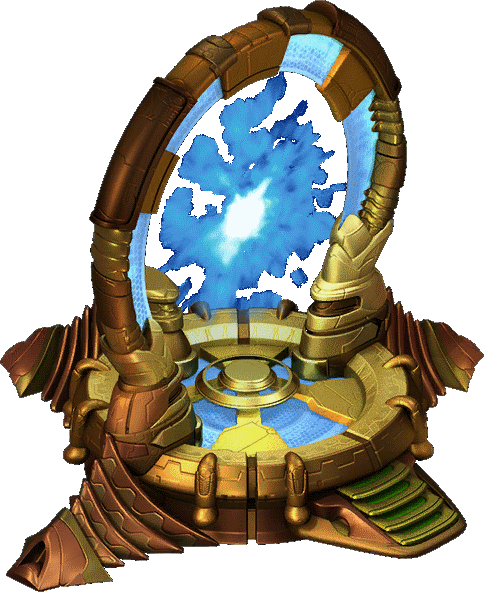

<h1> Good Tidings! I’m Bruce aka Lavitz Star </h1>

### Developer, Creative, Skill Collector, Eternal Student, Life Enjoyer

- 👨‍💻 I'm just a guy who loves a bit of everything. Vocationally, I love to code, think through complex problems, ideate innovative apps & games, design solutions, and constantly learn new technologies & methodologies
- 👀 Focusing on web3, games and human & environmental impact projects
- 🌱 I’m currently learning React & Next.js & TailwindCSS, cloud hosting, web3 & smart contracts, Unity, AI
- 📈 Working on multiple projects behind-the-scenes

# Stay tuned...

