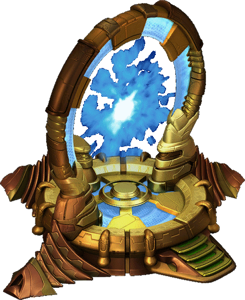
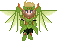

<h1> 👋 Hi, I’m Bruce AKA Lavitz Star </h1>

### Developer, Creative, Skill Collector, Eternal Student, Life Enjoyer

- 💫 I'm returning to coding after a year-long hiatus
- 👀 I’m interested in... everything! Focusing on web3, games and human & environmental impact projects
- 🌱 I’m currently learning Javascript, Node, React, React Native, databases, Cloud hosting, web3 & smart contrats, Unity & AI
- 📫 Reach me on twitter https://twitter.com/astralvitz
- 📝 Journaling my development journey https://astralvitz.github.io/
- 💡 Some game & app ideas & other things: https://github.com/astralvitz/astralvitz/

# Let's connect!

 

